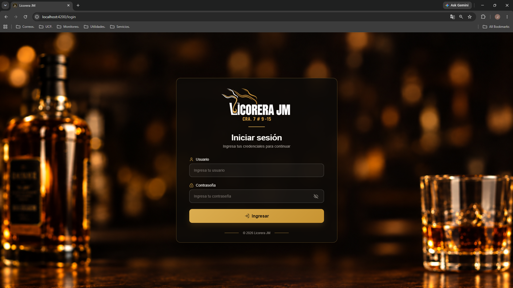
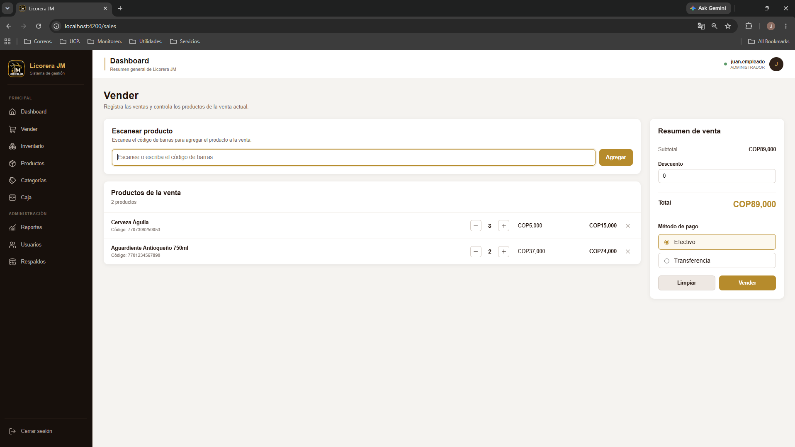
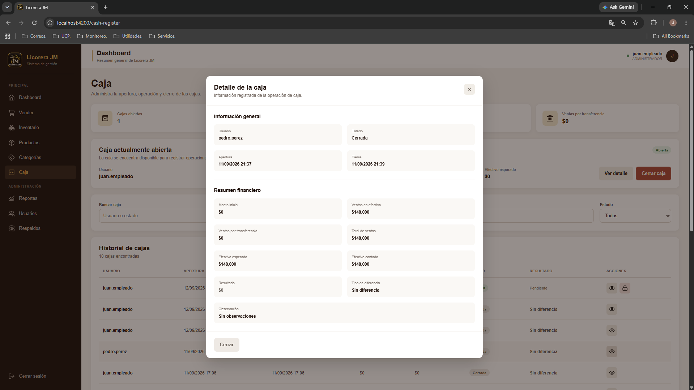
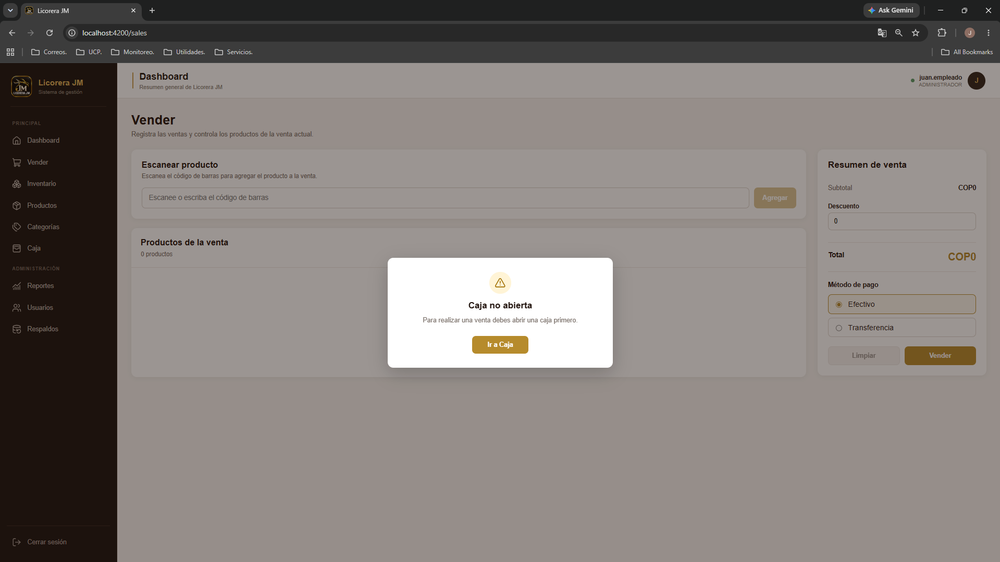
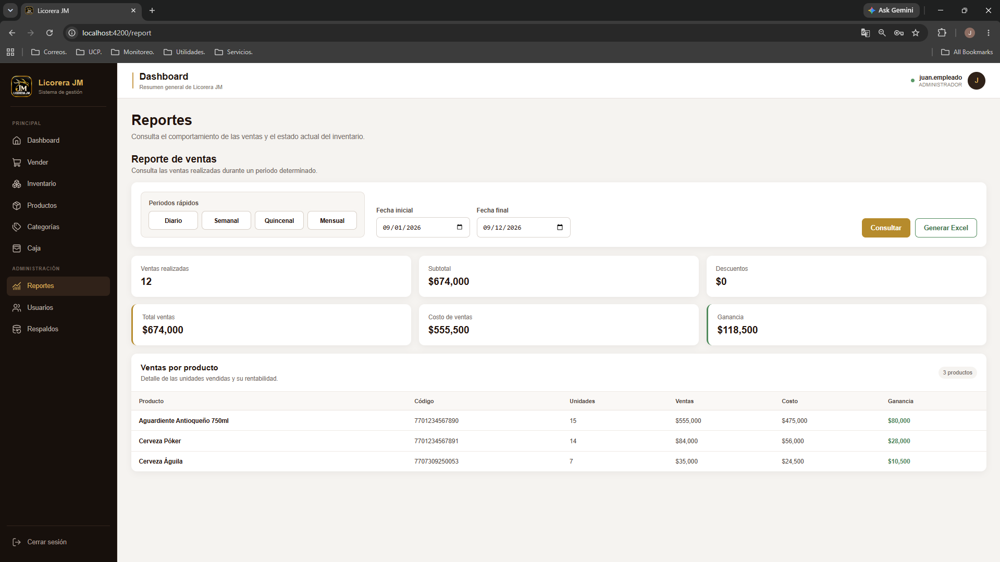
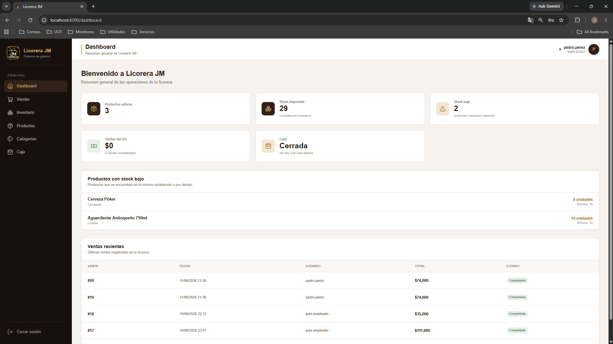
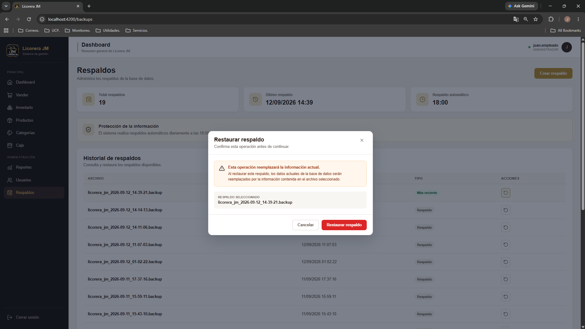

# Licorera JM Frontend

### 🖥️ Angular Frontend for Inventory, Sales & Cash Management

**Project Status:** 🟢 Stable / Completed

Licorera JM Frontend is the web interface of a full-stack management system designed for a local liquor store.

The application provides a modern Angular interface for managing products, inventory, sales, cash registers, reports, users, categories, and database backups.

It integrates with a Spring Boot REST API secured with JWT authentication and role-based authorization.

The system was designed as a complete business solution rather than a simple CRUD application, incorporating real-world inventory, sales, cash management, security, and deployment requirements.

---

## ✨ Features

### 🔐 Authentication & Authorization

- JWT-based authentication
- Protected application routes
- Authentication guard for private sections
- Administrator-only access for sensitive modules
- Role-based access control
- Current authenticated user information
- Automatic authorization header handling through an HTTP interceptor

### 📊 Dashboard

- Central application dashboard
- Navigation through the main business modules
- Sidebar and top navigation components
- User session information

### 📦 Product Management

- Create, update, and deactivate products
- Product search and listing
- Barcode-based product identification
- Category association
- Stock information

### 📥 Inventory Management

- Register new inventory entries
- Manage inventory lots
- Track quantities and purchase costs
- FIFO inventory management
- Barcode-based product workflows
- Inventory history

### 🛒 Sales Management

- Create sales
- Search products using barcodes
- Manage sale items and quantities
- Apply discounts
- Support cash and bank transfer payments
- Validate available stock
- Associate sales with an active cash register
- Cancel sales when permitted

### 💵 Cash Register

- Open cash registers
- View cash register information
- Close cash registers
- Support operational cash control

### 📈 Reports

- Sales summary
- Sales by product
- Inventory stock reports
- Administrative access control

### 👥 User Management

- User listing
- Create and update users
- Activate and deactivate users
- Role assignment
- Administrator-only access

### 🗂️ Category Management

- Create, update, and deactivate categories
- Category listing and management

### 💾 Backup & Restore

- View available backups
- Create backups
- Restore database backups
- Administrator-only access

---

## 🏗️ Application Architecture

The frontend follows a feature-based Angular architecture.

```text
Angular Application
│
├── Core
│   ├── Guards
│   │   ├── authGuard
│   │   └── adminGuard
│   │
│   └── Interceptors
│       └── authInterceptor
│
└── Features
    ├── Authentication
    ├── Dashboard
    ├── Products
    ├── Categories
    ├── Inventory
    ├── Sales
    ├── Cash Register
    ├── Reports
    ├── Users
    └── Backups
```

This structure separates cross-cutting application concerns from business features, making the frontend easier to maintain and extend.

---

## 🔒 Authentication & Authorization

The application uses JWT authentication integrated with the Spring Boot backend.

Authentication is handled through:

- Login service
- JWT token management
- Authentication guard
- Administrator guard
- HTTP authentication interceptor

Private routes require authentication, while sensitive administrative sections additionally require administrator authorization.

### 🛡️ Protected Routes

| Route            | Access              |
| ---------------- | ------------------- |
| `/dashboard`     | Authenticated users |
| `/sales`         | Authenticated users |
| `/inventory`     | Authenticated users |
| `/products`      | Authenticated users |
| `/categories`    | Authenticated users |
| `/cash-register` | Authenticated users |
| `/report`        | Administrators      |
| `/users`         | Administrators      |
| `/backups`       | Administrators      |

The `/login` route is publicly accessible.

---

## 🧭 Routing

Angular Router is configured with lazy-loaded components using `loadComponent`.

```text
/login
/dashboard
/sales
/inventory
/products
/categories
/cash-register
/report
/users
/backups
```

The default route redirects users to `/login`.

Lazy loading keeps application features separated and allows components to be loaded only when their routes are accessed.

---

## 🔌 HTTP Communication

The frontend communicates with the Licorera JM Spring Boot REST API through Angular's `HttpClient`.

The application uses a functional HTTP interceptor:

```text
authInterceptor
```

The interceptor is responsible for handling authentication information when communicating with protected backend endpoints.

The frontend is designed to work together with the Licorera JM Backend:

**Spring Boot REST API + PostgreSQL + JWT Authentication**

---

## 🧰 Technology Stack

| Technology         | Purpose                       |
| ------------------ | ----------------------------- |
| Angular 22         | Frontend framework            |
| TypeScript 6       | Application development       |
| Angular Router     | Client-side routing           |
| Angular HttpClient | REST API communication        |
| RxJS 7.8           | Reactive programming          |
| HTML5              | Application structure         |
| CSS3               | User interface styling        |
| Lucide Angular     | Interface icons               |
| xlsx               | Excel data processing/export  |
| Vitest             | Testing                       |
| JSDOM              | Browser environment for tests |
| npm 11             | Package management            |

---

## 📂 Project Structure

```text
licorera-jm-frontend/
│
├── public/
│
├── src/
│   ├── app/
│   │   ├── core/
│   │   │   ├── guards/
│   │   │   └── interceptors/
│   │   │
│   │   └── features/
│   │       ├── auth/
│   │       ├── backup/
│   │       ├── cash-register/
│   │       ├── category/
│   │       ├── dashboard/
│   │       ├── inventory/
│   │       ├── product/
│   │       ├── report/
│   │       ├── sale/
│   │       └── user/
│   │
│   ├── app.config.ts
│   ├── app.routes.ts
│   ├── app.html
│   ├── app.css
│   ├── main.ts
│   ├── proxy.conf.json
│   └── styles.css
│
├── angular.json
├── package.json
├── package-lock.json
├── tsconfig.json
└── README.md
```

Each business feature contains its own components, services, models, HTML templates, and styles where applicable.

---

## ⚙️ Local Installation

### 📋 Requirements

- Node.js
- npm 11
- Angular CLI 22
- Licorera JM Backend

### 📦 Install Dependencies

```bash
npm install
```

### ▶️ Start the Development Server

```bash
npm start
```

The Angular development server will start locally.

The application can then be accessed through the URL provided by Angular CLI.

---

## 🏭 Production Build

To generate a production build:

```bash
npm run build
```

The generated application is placed in the Angular build output directory.

The production frontend can be served through a web server such as Caddy and integrated with the Licorera JM backend.

---

## 🧪 Development & Testing

For continuous development builds:

```bash
npm run watch
```

To execute the test suite:

```bash
npm test
```

---

## 📸 Screenshots

The following screenshots showcase the main application interfaces and demonstrate the system running through its Angular frontend.

### 🔐 Login

Application authentication interface for accessing the system.



### 📊 Dashboard

Main application dashboard providing access to the system's business modules.


### 📦 Products

Product management interface for creating, updating, searching, and managing products.


### 📥 Inventory

Inventory management interface for registering stock entries and managing inventory information.


### 🔄 FIFO Inventory

Inventory interface demonstrating lot-based stock management and FIFO cost control.


### 🛒 Sales

Sales interface for processing products, quantities, discounts, and payment methods.



### 💵 Cash Register

Cash register interface for opening and managing the active business cash register.



### 🔒 Cash Register Validation

Interface demonstrating the business rule that requires an active cash register before processing sales operations.



### 📈 Reports

Reporting interface for reviewing sales and inventory information.



### 👤 User Roles

User management interface demonstrating role-based access and employee permissions.



### 💾 Backup & Restore

Backup management interface for creating and restoring database backups.



---

## 🪟 Windows Deployment

Licorera JM was packaged as a standalone Windows application together with its backend infrastructure.

The complete solution includes:

- Angular frontend
- Spring Boot backend
- PostgreSQL
- Java 17
- Caddy
- Windows Services
- WinSW
- Inno Setup

A standalone Windows installer was created for the complete application:

```text
LicoreraJM-Setup.exe
```

The installer-based deployment was tested on a separate Windows machine to validate the installation and operation of the complete system.

---

## 🔗 Backend Integration

The frontend consumes the Licorera JM REST API.

**Backend Repository:**

[Licorera JM Backend](https://github.com/joserestrepog/licorera-jm-backend)

The backend provides:

- REST API
- PostgreSQL persistence
- JWT authentication
- Role-based authorization
- FIFO inventory logic
- Sales management
- Cash register management
- Reports
- Backup and restore functionality

---

## 🎯 Project Goals

Licorera JM was designed to demonstrate the development of a complete full-stack business application using modern technologies and real-world requirements.

The project focuses on:

- Full-stack development
- REST API integration
- Authentication and authorization
- Inventory management
- FIFO cost management
- Sales and cash control
- Business-oriented application architecture
- Windows deployment and installation
- Maintainable and scalable frontend organization

---

## 👨‍💻 Author

**Jose Restrepo**

Full Stack Developer | Java · Spring Boot · Angular · PostgreSQL

GitHub:

[github.com/joserestrepog](https://github.com/joserestrepog)

---

## 📄 License

This project is intended as a portfolio and software development project.
